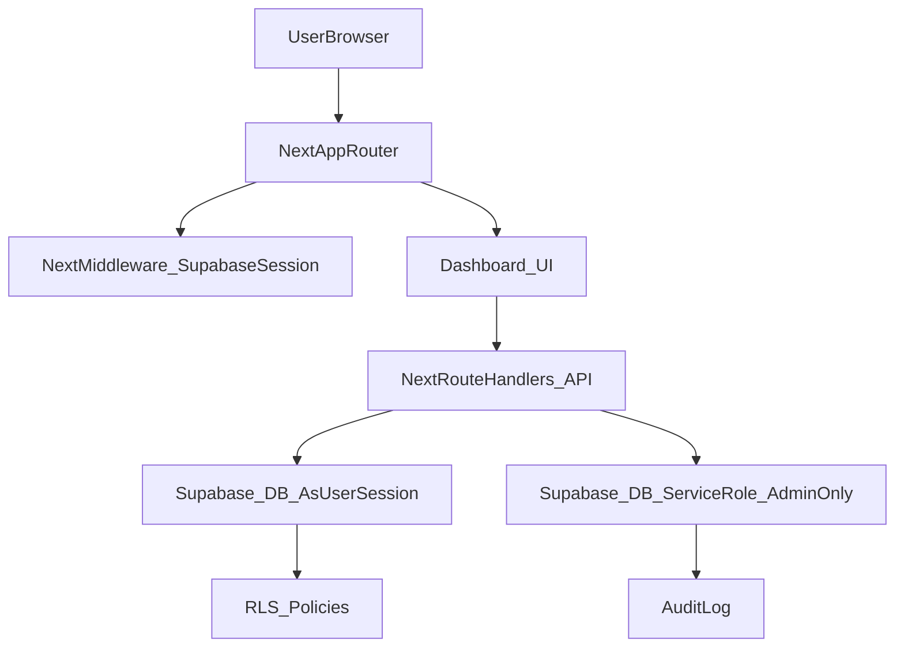

# Reporte CTO — AssistMed AI (auditoría técnica + clínica)

**Fecha**: 2026-03-16  
**Contexto**: SaaS médico (Next.js App Router + React/TS + Supabase) con objetivo **multi-clínica** y roles **admin/doctor/assistant**.  
**Criterio CTO**: “¿Está listo para venderse a consultorios y clínicas reales?” con foco en **aislamiento multi-tenant**, **PHI/PII**, **operación clínica**, **auditoría y trazabilidad**.

---

## 1) Diagnóstico general del sistema

**Veredicto**: **NO** está listo para venderse a clínicas reales en su estado previo (antes de hardening), principalmente por:
- **Riesgo crítico de aislamiento multi-clínica** (RLS/policies potencialmente incorrectas) y dependencia excesiva de **service role** en API routes.
- **Exposición de datos sensibles en cliente** (consultas directas desde navegador, `select('*')` y PHI “oculta” solo por UI).
- **Mismatches UI ↔ BD** (campos usados en UI que no aparecen en `schema.sql`/`schema_update_multi_clinic.sql`), que rompe operación real y seguridad.
- **Flujo clínico incompleto**: falta “cadena” agenda→check-in→consulta→cobro→seguimiento como proceso estable y auditable.

**Mejoras ya aplicadas en este repo durante la auditoría (hardening inicial)**:
- Se eliminó archivo con **key** expuesta: `src/app/api/test_query/route.ts` (borrado).
- Se activó middleware real de Supabase para refresh de sesión: `src/middleware.ts`.
- Se mitigó **mass-assignment** en updates:
  - `src/app/api/patients/update/route.ts`
  - `src/app/api/consultations/update/route.ts`
- Se sanitizó `q` en búsqueda para reducir riesgo de “filter injection” PostgREST:
  - `src/app/api/patients/search/route.ts`
- Se añadieron límites/validación a subida de avatar:
  - `src/app/api/storage/upload-avatar/route.ts`
- Se corrigió handoff `agenda/billing → consultations?patient_id=...` para preselección:
  - `src/app/dashboard/consultations/page.tsx`
  - `src/components/ConsultationForm.tsx`
- Se evitó que `Agenda` llame endpoints admin para roles no-admin:
  - `src/app/dashboard/agenda/page.tsx`
- Se movió lectura/creación de pacientes hacia API routes (reduce PHI en cliente, prepara RLS):
  - `src/components/PatientList.tsx`
  - `src/components/PatientForm.tsx`
  - creación rápida de paciente en `Agenda` y `AssistantDashboard` ahora usa `/api/patients/create`

---

## 2) Lista de problemas encontrados (por severidad)

### Críticos (bloquean venta)
- **RLS multi-clínica no confiable**: en `supabase/schema_update_multi_clinic.sql` hay políticas que comparan `clinic_id = <tabla>.clinic_id`, lo cual dentro de la misma tabla es una **tautología** (condición siempre verdadera) y puede permitir **acceso cross-clinic**.
- **Policies “FOR ALL” sin `WITH CHECK`**: permite insertar/actualizar filas fuera de los límites esperados si no se valida la fila nueva/modificada.
- **Exposición de PHI/PII vía cliente**: `select('*')` y consultas directas desde navegador; “ocultar” datos en UI no evita exfiltración por Network/DevTools.
- **Uso amplio de service role** (`supabaseAdmin`) para operaciones clínicas normales: cualquier bug en autorización/filtrado = bypass total de RLS.
- **Mismatches UI↔DB**: UI depende de columnas como `billing.paid` y campos en `appointments` (`time/type/status`) que no están garantizados en scripts SQL del repo.
- **Key expuesta en repo** (ya eliminada): riesgo de fuga y abuso.

### Altos (impactan seguridad, operación y confianza)
- **Mass-assignment** en updates (ya mitigado): riesgo de actualizar campos no permitidos.
- **Búsqueda con filtro `.or()` interpolado** (mitigado parcialmente): riesgo de manipulación de sintaxis PostgREST.
- **Seguimiento codificado en texto + regex**: rompe trazabilidad, no permite estados ni reportes confiables.
- **Billing operativo fragmentado**: cobro real en `AssistantDashboard`, mientras `/dashboard/billing` es registro casi read-only.
- **`profiles.role` inconsistente vs código**: scripts SQL base restringen roles, pero el app usa `admin`.

### Medios/Bajos (deuda técnica/UX/performance)
- Falta tipado fuerte (types Supabase generados).
- Duplicación de lógica entre dashboards/páginas (agenda/crear paciente).
- Falta observabilidad/auditoría (event log) para un sistema médico.

---

## 3) Riesgos de seguridad (amenazas reales)

### Aislamiento multi-tenant (multi-clínica)
- **Acceso cruzado entre clínicas**: si una policy queda “siempre true”, un doctor o asistente puede leer datos de otra clínica (PHI/PII). Esto es un **showstopper** para venta.
- **Writes fuera del tenant**: sin `WITH CHECK`, un usuario puede insertar/actualizar filas apuntando a otra clínica/doctor, contaminando datos y rompiendo auditoría.

### Exposición de datos médicos (PHI)
- **PHI en cliente**: cualquier `select('*')` o consulta directa con ANON key hace que el navegador reciba PHI aunque la UI no la muestre.
- **Storage público**: bucket público + paths predecibles puede permitir enumeración/descarga si el naming no es robusto (además de riesgos de compliance).

### Endpoints y service role
- **Service role** en rutas de negocio clínico: si `authorizeUser` falla o se omite un filtro, se produce fuga total (RLS no protege).
- **Validación insuficiente**: inputs no validados pueden romper reglas clínicas, generar datos inconsistentes y abrir puertas a abuso (DoS/costo en uploads, por ejemplo).

---

## 4) Problemas de arquitectura (frontend/backend)

### Patrón actual
- **App Router** con `dashboard/layout.tsx` como “choke point” de sesión/rol (server) y `RoleContext` (client).
- **Data access mixto**: cliente directo a Supabase + API routes con `supabaseAdmin` (service role). Esto crea **inconsistencia** y hace difícil asegurar permisos.

### Problemas concretos (con archivos)
- **Middleware no ejecutaba refresh** (solucionado): se agregó `src/middleware.ts` (antes existía `src/proxy.ts` pero no era middleware real).
- **UI y backend divergen del schema**: UI asume columnas no garantizadas por SQL del repo.
- **Acoplamiento de flujo a texto**: seguimiento en `consultations.notes` y parsing en `src/components/dashboards/AssistantDashboard.tsx`.
- **PHI por `select('*')`** (mitigado en pacientes): `src/components/PatientList.tsx` ahora usa `/api/patients/list` y el endpoint retorna columnas limitadas para assistants.

---

## 5) Problemas en el flujo clínico (operación real)

### Paso 1: agenda (asistente)
**Parcial**: existe agenda y creación rápida de paciente.  
**Faltante**: estados de cita, confirmación, cancelación/no-show, y “check-in”.

### Paso 2: llegada/validación de adeudos
**No implementado como gate**: “adeudos” hoy se derivan de `billing` post-consulta; no hay balance por paciente ni regla de bloqueo configurable.

### Paso 3: consulta médica
**Existe**: captura de signos y registro de consulta.  
**Faltante**: abrir consulta “desde cita”, estados clínicos (borrador/firmada), firma del médico, y cronología del expediente.

### Paso 4: facturación
**Fragmentado**: cobro/validar pago está en `AssistantDashboard`; `/dashboard/billing` no opera el cobro.

### Paso 5: seguimiento
**Frágil**: se basa en texto y regex.  
**Faltante**: entidad estructurada de seguimiento, estados y tablero de tareas.

---

## 6) Mejoras prioritarias (0–30 días, para “vendible”)

### 6.1 Seguridad y multi-tenant (bloqueante)
- **Corregir RLS** (ver `supabase/schema_update_multi_clinic.sql`): reescribir policies para que comparen contra `profiles.clinic_id` del usuario y agregar `WITH CHECK`.
- **Reducir superficie de PHI en cliente**: eliminar `select('*')` de tablas clínicas; usar API routes que devuelvan columnas mínimas por rol.
- **Limitar service role**: usar `supabaseAdmin` solo para admin SaaS; operaciones clínicas con cliente server de sesión.

### 6.2 Consistencia de esquema
- Consolidar el DB en **migraciones** y eliminar dependencia de scripts sueltos.
- Alinear `appointments` y `billing` con lo que usa la UI (o viceversa) y hacerlo enforceable con constraints.

### 6.3 Flujo clínico end-to-end
- Estados de cita + “check-in”.
- Link `appointment_id` en `consultations` (o `consultation_id` en `appointments`).
- “Bandeja de cobros” operativa en `/dashboard/billing` (pendientes/pagados).
- Seguimiento estructurado (tabla o campos), no regex.

---

## 7) Mejoras recomendadas (30–90 días)
- **Recetas imprimibles** (PDF) + plantillas por clínica + firma digital simple.
- **Recordatorios de citas** (WhatsApp/email/SMS) con opt-in/consentimiento.
- **Historial cronológico del paciente** (timeline) con filtros (consultas, recetas, estudios, pagos).
- **Auditoría (event log)**: quién vio/creó/modificó PHI (mínimo para soporte y control interno).
- **Telemedicina (opcional)**: enlace de videollamada + consentimiento + anexos.

---

## 8) Arquitectura ideal (propuesta)

Principios:
- **PHI minimizada en cliente** (column-level por rol).
- **RLS como “cinturón”**, pero la app también valida (defensa en profundidad).
- **Service role** solo para administración SaaS y jobs internos.
- **Auditoría** como requisito (no “nice to have”).

---

## 9) Roadmap técnico sugerido
- **Fase 0 (bloqueante)**: RLS correcto + esquema consistente + eliminar exposición PHI + hardening endpoints/storage.
- **Fase 1 (operación clínica)**: agenda con estados + check-in + consulta desde cita + billing operativo + seguimiento estructurado.
- **Fase 2 (SaaS)**: métricas, planes/suscripciones robustas, reportes, automatizaciones, auditoría y retención.

